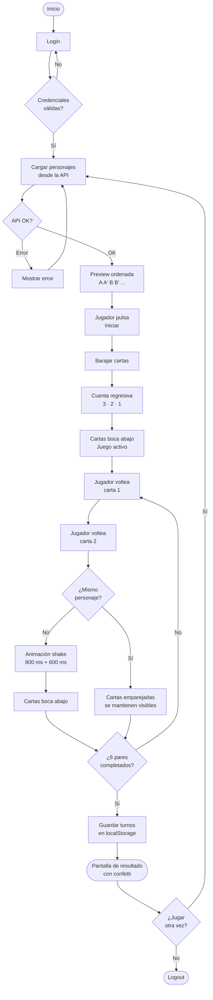

# Mind & Morty — Juego de Memoria

Juego de memoria temático de Rick and Morty. El jugador debe encontrar los 6 pares de personajes en el menor número de turnos posible.

---

## Demo

**Credenciales de acceso:**

| Campo      | Valor                  |
| ---------- | ---------------------- |
| Email      | `demo@memorygame.com`  |
| Contraseña | `password123`          |

---

## Flujo de juego



> Si estás viendo esto en GitHub, el diagrama ya debería estar renderizado. Si no es así, copia el bloque de arriba y pégalo en [mermaid.live](https://mermaid.live) — es lo más rápido. También puedes usar [diagrams.net](https://app.diagrams.net) desde Extras → Edit Diagram, o si prefieres no salir del editor, la extensión [Markdown Preview Mermaid Support](https://marketplace.visualstudio.com/items?itemName=bierner.markdown-mermaid) de VS Code lo muestra directamente con `Ctrl/Cmd + Shift + V`.

---

## Instalación y ejecución

```bash
# Instalar dependencias
npm install

# Servidor de desarrollo
npm run dev

# Build de producción
npm run build

# Previsualizar build
npm run preview

# Linting
npm run lint

# Formateo
npm run format

# Ejecutar tests (una sola pasada)
npm test

# Ejecutar tests en modo watch interactivo
npm run test:watch
```

---

## Stack técnico

| Tecnología         | Versión | Rol                    |
| ------------------ | ------- | ---------------------- |
| React              | 19      | UI                     |
| TypeScript         | 6       | Tipado estático        |
| Vite               | 8       | Bundler / Dev server   |
| Zustand            | 5       | Estado global          |
| Framer Motion      | 12      | Animaciones            |
| React Router DOM   | 7       | Enrutamiento           |
| SCSS               | 1.99    | Estilos                |
| Vitest             | 4       | Testing                |
| Rick and Morty API | —       | Datos de personajes    |

---

## Estructura del proyecto

```text
src/
├── app/            # Router, layouts y ProtectedRoute
├── components/     # Componentes UI reutilizables (Button, Card, Input, GameCard)
├── constants/      # Valores estáticos (paleta de confetti)
├── hooks/          # Hooks personalizados (useWindowSize)
├── pages/          # Vistas completas (LoginPage, GamePage, ResultPage)
├── store/          # Stores de Zustand (authStore, gameStore)
├── styles/         # SCSS modular (base/, components/, pages/)
└── types/          # Definiciones TypeScript centralizadas
```

---

## Historial de decisiones

### CSS Modules → SCSS global + BEM

CSS Modules resuelve el problema de colisión de nombres por scoping automático, pero introduce una fricción real cuando el sistema de estilos tiene que ser cohesivo: cada archivo necesita su propio `@use` para acceder a variables compartidas, los nombres de clase se transforman a camelCase en el JSX rompiendo la legibilidad del markup, y el pipeline de tokens centralizados se convierte en un contrato implícito que cada módulo debe honrar individualmente.

La alternativa — SCSS global con BEM — invierte el trade-off: cambio el scoping automático por convención explícita. BEM hace que la responsabilidad de cada clase sea obvia por su nombre (`.game-card__inner`, `.button--primary`), y un único `main.scss` como punto de entrada garantiza que todos los componentes compartan el mismo contexto de variables sin configuración adicional. Para una aplicación de este tamaño, la convención es más mantenible que el tooling.

### Una sola llamada a la API, duplicación en cliente

La API acepta múltiples IDs en una sola request (`/character/1,4,7...`) y devuelve un array. Hacer seis llamadas paralelas habría sido innecesario: más superficie de error, más lógica de coordinación, mismos datos. Se genera un conjunto de IDs aleatorios, se hace una request y se duplican las cartas en cliente con `flatMap` para formar los pares. El único comportamiento no documentado de la API: cuando se solicita un solo ID devuelve un objeto en lugar de un array, lo que requiere normalización explícita con `Array.isArray`.

### Separación de `initGame` y `startGame`

El juego tiene dos operaciones conceptualmente distintas que no deben mezclarse: cargar datos de la API y comenzar a jugar. `initGame` es una operación asíncrona que obtiene personajes y construye el tablero en orden `[A, A', B, B'...]` — sin barajar, para que el jugador pueda estudiar los pares. `startGame` es sincrónica: baraja las cartas y activa la fase de memorización. Fusionarlas habría acoplado la lógica de red con la lógica de juego y habría hecho imposible reiniciar una partida sin volver a llamar a la API.

### Modelo de fases explícitas en el store

Un solo `isPreview: boolean` no es suficiente para describir todos los estados del juego. Existen al menos tres situaciones distintas donde las cartas están boca arriba: preview ordenado, shuffle con countdown activo, y cartas emparejadas durante el juego. Modelar eso con un booleano obliga a inferir el estado real a partir de combinaciones de flags, lo que es una fuente directa de bugs.

La solución fue definir fases explícitas con flags ortogonales: `isPreview` (cartas visibles), `isMemorizing` (barajadas + countdown) e `isLocked` (evaluación de par en curso). Cada acción del store tiene una responsabilidad única dentro de esta máquina: `initGame` → `startGame` → `beginPlay` → `flipCard`. Ningún componente necesita inferir en qué fase está el juego.

### Animación de reordenamiento sin lógica de posición

Calcular y animar manualmente el movimiento de doce cartas hacia nuevas posiciones en el grid requeriría conocer las coordenadas de origen y destino de cada carta — lógica de layout que no pertenece al dominio del juego. Usando `layout` y `layoutId` en cada `GameCard`, Framer Motion intercepta los cambios de posición en el DOM causados por el reordenamiento del array y genera las animaciones automáticamente. La única responsabilidad del store sigue siendo el orden del array.

### Feedback de fallo en dos tiempos

Voltear las cartas inmediatamente tras un fallo penaliza al jugador: no tuvo tiempo real de registrar lo que mostró la segunda carta. El diseño deliberado es: 800 ms con ambas cartas visibles para que el cerebro procese la información, luego animación de shake via `errorIds` como confirmación visual del error, y 600 ms adicionales antes de voltearlas. No es un detalle cosmético — es parte de la mecánica de memorización.

### Persistencia de auth con middleware `persist`

La primera implementación gestionaba el token con `localStorage.setItem/getItem` directamente en el módulo del store, fuera del ciclo de Zustand. El problema estructural es que el estado del store y el estado de `localStorage` se volvían dos fuentes de verdad que había que mantener sincronizadas manualmente. El middleware `persist` de Zustand resuelve esto: el store es la única fuente de verdad y la serialización a `localStorage` es un efecto secundario transparente. `partialize` excluye las funciones de la serialización para evitar intentar persistir referencias no serializables.

### Jest → Vitest

Jest opera en un entorno CommonJS y Zustand 5 es ESM puro. Hacer que coexistan requiere configurar `transformIgnorePatterns` para que Babel transpile los módulos de `node_modules` afectados, además de un `babel.config.json` separado solo para el contexto de tests. Es overhead de configuración que no aporta valor y que introduce una asimetría: el código de producción corre en ESM nativo a través de Vite, pero los tests corren en un entorno transformado con reglas distintas.

Vitest usa el mismo pipeline de Vite, por lo que ESM funciona de forma nativa sin configuración adicional. La config de tests vive en `vite.config.ts` junto al resto del tooling, los tipos de globals (`describe`, `vi`, `expect`) se resuelven con un solo entry en `tsconfig.app.json`, y no existe fricción entre el entorno de desarrollo y el de tests.

---

## Definiciones técnicas

### Máquina de estados del juego

El flujo del juego se modela como una secuencia de fases explícitas en `gameStore`. Cada flag representa una condición ortogonal e independiente; ningún componente infiere el estado combinando múltiples flags:

| Flag             | Descripción                                                       |
| ---------------- | ----------------------------------------------------------------- |
| `isLoading`      | Cargando personajes desde la API                                  |
| `isPreview`      | Cartas visibles (ordenadas antes del inicio)                      |
| `isMemorizing`   | Cartas barajadas, cuenta regresiva activa                         |
| `isLocked`       | Bloqueado durante la evaluación de un par (evita race conditions) |
| `isGameFinished` | Todos los pares encontrados                                       |
| `hasError`       | Fallo en la llamada a la API                                      |

La transición entre fases sigue la secuencia `initGame → startGame → beginPlay → flipCard`, donde cada acción tiene una responsabilidad única y no produce efectos secundarios fuera de su fase.

### Flip 3D de cartas

El efecto de volteo se implementa íntegramente en CSS sin JavaScript para el cálculo de posición. El contenedor de cada carta usa `transform-style: preserve-3d`, lo que establece un contexto 3D independiente para sus hijos. Las dos caras (frente y reverso) se posicionan con `position: absolute` y `backface-visibility: hidden` para que cada una solo sea visible desde su lado. La cara frontal parte con `rotateY(180deg)`, de modo que animar el contenedor a `rotateY(180deg)` la revela mientras oculta el reverso.

Framer Motion gestiona los estados de animación (`isFlipped`, `isMatched`, `isError`) como transiciones declarativas sobre ese mecanismo CSS, añadiendo `scale` en acierto y `translateX` en shake de fallo.

### Zustand como única fuente de verdad

Todo el estado de la aplicación vive en dos stores especializados: `authStore` para sesión y `gameStore` para lógica de juego. Los componentes acceden al estado mediante selectores granulares (`useGameStore(s => s.cards)`), lo que evita re-renders innecesarios cuando cambian partes del estado que el componente no consume.

Las acciones encapsulan toda la lógica de negocio, incluyendo los `setTimeout` del ciclo de evaluación de pares. Los componentes solo invocan acciones — nunca calculan estado derivado ni coordinan timers.

### Persistencia con middleware `persist`

`authStore` usa el middleware `persist` de Zustand con `partialize` para serializar únicamente los campos de datos (`isAuthenticated`, `token`, `user`), excluyendo las funciones del store. Zustand rehidrata el estado automáticamente al montar la aplicación, eliminando la necesidad de leer `localStorage` manualmente en ningún componente.

El resultado del juego (`turns`) se persiste por separado en `localStorage` con una clave dedicada (`game-result`), independiente del store de auth, y se elimina en logout y en reset de partida.

### Animación de reordenamiento con `layoutId`

Framer Motion implementa FLIP (_First, Last, Invert, Play_) internamente cuando un elemento con `layoutId` cambia de posición en el DOM. Al reordenar el array de cartas en el store, React re-renderiza el grid con las cartas en nuevas posiciones; Framer Motion captura las coordenadas antes y después del render y genera la transición de movimiento automáticamente. El store solo gestiona el orden del array — ningún componente calcula posiciones.

### SCSS global + sistema de tokens

Todos los valores visuales se definen como variables SCSS en `_variables.scss` (colores, tipografía, espaciado, breakpoints, sombras, radios, tamaños de componentes). Los archivos de estilos los consumen con `@use '../base/variables' as *`. No existen valores hardcodeados en componentes ni estilos inline en el JSX.

La nomenclatura BEM (`.game-card__inner`, `.button--primary`) hace que la relación entre el markup y los estilos sea explícita sin necesidad de scoping automático. El punto de entrada único (`main.scss`) garantiza que el orden de carga de estilos sea determinista.

### ProtectedRoute y Fast Refresh

`ProtectedRoute` vive en su propio archivo separado de `router.tsx`. React Fast Refresh requiere que cada módulo exporte exclusivamente componentes React o exclusivamente no-componentes — mezclarlos deshabilita el HMR para ese archivo. `router.tsx` exporta la constante `router` (no un componente), por lo que `ProtectedRoute` no puede coexistir en el mismo módulo sin romper el comportamiento de recarga en caliente.
